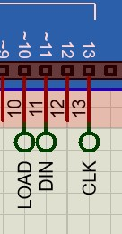

# **Práctica 1**
### Universidad de San Carlos de Guatemala
### Facultad de Ingeniería
### Escuela de Ciencias y Sistemas
### Arquitectura de Computadores y Ensambladores 1
### Sección B
<br></br>

## **Manual Técnico**
<br></br>

| Nombre | Carnet | 
| --- | --- |
| Daniel Estuardo Cuque Ruíz | 202112145 |
| Damián Ignacio Peña Afre | 202110568 |
| Alvaro Norberto García Meza | 202109567 |
| José Manuel Ibarra Pirir | 202001800 |
----
# **Introducción**
## Descripción general
La práctica consiste en la creación de un prototipo que contiene un display que está conformado por 2 matrices LED de 8x8. Es capaz de presentar un mensaje de forma dinámica que puede ser manejado por medio de dos botones. Un tercer botón permite al usuario ingresar a una partida de una variación del juego "breakout" permitiendo interactual al usuario con el juego. 
## Objetivos y Alcance
El objetivo del prototipo es el manejo de matrices de dos maneras: por medio de controladores y sin controladores. Permitiendo al usuario experimentar con los mensajes y jugar una variación del juego "breakout". 
## Términos clave
- MAX7219
- Driver
- Matriz LED
- Potenciómetro
# **Materiales y Herramientas**
- Una placa Arduino MEGA
- Un controlador MAX7219: es un circuito integrado que facilita el control de LEDs. Es usado principalmente en pantallas de 7 segmentos, paneles de LEDs industriales y como controlador de matriz de LED con Arduino.
- Matrices LED de 8x8: es un display formado por múltiples LED en distribución rectangular.
- 3 Botones
- Un potenciómetro: es un componente electrónico similar a los resistores pero cuyo valor de resistencia en vez de ser fijo es variable, permitiendo controlar la intensidad de corriente a lo largo de un circuito conectándolo en paralelo ó la caida de tensión al conectarlo en serie.
- Resistencias
- Sounder
# **Montaje del Hardware**
A continuación se explica la conexión entre la placa Arduino MEGA y los demás componentes.
- Conexión para Comunicación Serial: Se utilizaron los pines RXO Y TX0. <br>

- Conexión con los botones: se utilizaron los pines 5, 6 y 7.<br>

- Conexión con el sounder: se utilizó el pin 8. <br>

- Conexión con el driver MAX7219: se utilizaron los pines 10, 11 y 13, el pin 10 se conectó con el LOAD del MAX7219, el pin 11 se conectó con el DIN del MAX7219 y el pin 13 se conectó al CLK del MAX7219.<br>

- Conexión con las Matrices LED sin driver: se utilizaron los pines del 30 al 37 para la conexión de las filas y los pines del 40 al 47 para la conexión de las columnas.<br>


A continuación se muestra la conexión entre el driver MAX7219 con la matriz que es manejada por el mismo:
por parte del Driver, se conectó de las salidas A-G y DP, con las columnas y de las salidas DIG0-DIG7 las filas. Adicional a esto de la salida ISET se colocó la alimentación y una resistencia. <br>

# **Programación del Software**
## Carga del código en la placa Arduino
- Es necesario corroborar que el archivo *.hex* generado en la compilación del archivo con el *IDE Arduino* esté instalado en la placa, para ello debemos dar doble click sobre la placa Arduino y verificar la dirección en el apartado de *PROGRAM FILE*. <br>


- De no encontrarse algún archivo seleccionado, es necesario colocar el archivo *.hex*, para ello debemos darle click al ícono de folder en el apartado de *PROGRAM FILE*, esto nos abrirá un selector de archivos, donde debemos buscar la carpeta de nombre *build* el ella se encontrarán 3 archivos, debemos seleccionar el de nombre *src.ino.with_bootloader.hex* <br>

## Código
### **Manejo del Mensaje de inicio**
#### ***Matriz manejada sin driver***
En la siguiente función se muestra como es el seteo de la matriz manejada sin driver, haciendo uso de ciclos for. 
```
void NoDriverMatrix::setMatrix(bool matrix[8][8]) {
    for(int row = 0; row < 8; row++){

        // Turn on the row
        digitalWrite(this->rowPins[row], LOW);

        // Turn on the columns
        for(int column = 0; column < 8; column++){
            
            if(matrix[row][column]){
                digitalWrite(this->columnPins[column], HIGH);
            }
        }

        // Delay
        // TODO: USE MILLIS() INSTEAD OF DELAY()
        delay(1);

        // Turn off the row
        digitalWrite(this->rowPins[row], HIGH);

        // Turn off the columns
        for(int column = 0; column < 8; column++){
            digitalWrite(this->columnPins[column], LOW);
        }
    }
};

```
#### ***Matriz manejada con driver***

Se utiliza la clase para establecer el lugar de las dos matrices que contiene el manejo dual de las matrices.
```
DualMatrixController::DualMatrixController(NoDriverMatrix*leftMatrix,LedControl *rightMatrix) {
    this->leftMatrix = leftMatrix;
    this->rightMatrix = rightMatrix;
}
```
La siguiente función establece la matriz del aldo izquierdo que es manejada por medio de driver.
```
void DualMatrixController::setLeftMatrix(bool matrix[8][8]) {
    this->leftMatrix->setMatrix(matrix);
}
```
La siguiente función establece la matriz del aldo derecho que es manejada sin controlador:
```
void DualMatrixController::setRightMatrix(bool matrix[8][8]) {
    for (int i = 0; i < 8; i++) {
        for (int j = 0; j < 8; j++) {
            this->rightMatrix->setLed(0, i, j, matrix[i][j]);
        }
    }
}
```
La siguiente función recibe una matriz de [8][16], esta se separa en dos. 
```
void DualMatrixController::setMatrix(bool matrix[8][16]) {
    bool lf[8][8];
    bool rm[8][8];

    // Split the matrix in two
    for (int i = 0; i < 8; i++) {
        for (int j = 0; j < 8; j++) {
            lf[i][j] = matrix[i][j];
            rm[i][j] = matrix[i][j + 8];
        }
    }

    this->leftMatrix->setMatrix(lf);
    
    for (int i = 0; i < 8; i++) {
        for (int j = 0; j < 8; j++) {
            this->rightMatrix->setLed(0, i, j, rm[i][j]);
        }
    }

}
```
La siguiente función inicia la matriz, encendiendo los LED y limpiando el display. 
La siguiente función recibe una matriz de [8][16], esta se separa en dos. 
```
void DualMatrixController::initMatrix(void) {
    this->leftMatrix->initMatrix();
    this->rightMatrix->shutdown(0, false);
    this->rightMatrix->setIntensity(0, 8);
    this->rightMatrix->clearDisplay(0);
}
```
La siguiente función reetablece la matriz en una matriz vacía.
```
void DualMatrixController::resetMatrix(void) {
    this->leftMatrix->resetMatrix();
    this->rightMatrix->clearDisplay(0);
}
```
#### ***Establecimiento de ambas matrices***
```
//Matriz manejada sin driver
int leftMatrixRowPins[8] = {30,31,32,33,34,35,36,37}; //pines utilizados para las filas.
int leftMatrixColumnPins[8] = {40,41,42,43,44,45,46,47}; //ínes utilizados para las columnas

NoDriverMatrix leftMatrix(leftMatrixRowPins, leftMatrixColumnPins);

//Matriz manejada con driver. 
//DIN,CLK,LOAD,#Devices
LedControl rightMatrix(11, 13, 10, 1);

//Instancia final
DualMatrixController screen(&leftMatrix, &rightMatrix);
```
### Lógica del Juego
Formación de ladrillos
```
Brick::Brick(int objectRow, int objectColumn) {
    this -> objectRow = objectRow;
    this -> objectColumn = objectColumn;
    this -> objectType = 3;
}
```
Formación de Paddle
```
Paddle::Paddle(int objectRow, int objectColumn) {
    this -> objectRow = objectRow;
    this -> objectColumn = objectColumn;
    this -> objectType = 2;
}
```
Creación de Pelota
```
Ball::Ball() { //Creación de la pelota
    this -> objectType = 1;
}
void Ball::setPos(int objectRow, int objectColumn) { //Posicion
    this -> objectRow = objectRow;
    this -> objectColumn = objectColumn;
}

void Ball::setSpeed(int rowSpeed, int columnSpeed) { //Establecimiento de velocidad
    this -> columnSpeed = columnSpeed;
    this -> rowSpeed = rowSpeed;
}

void Ball::invertcolumnSpeed() { //Inversión de la dirección horizontal cuando colisiona
    this -> columnSpeed = -this -> columnSpeed;
}

void Ball::invertrowSpeed() { //Inversión de la dirección vertical cuando colisiona
    this -> rowSpeed = -this -> rowSpeed;
}
```
#### ***Juego***
Reseteo del tablero
```
for (int i = 0; i < 8; i++){
    for (int j = 0; j < 16; j++){
        this -> table[i][j] = nullptr;
    }
}
```
Creación de ladrillos
```
for(int i = 0; i < 4; i++){
    for (int j = 0 ; j < 16; j+= 2){
        Brick *rBrick = new Brick(i,j + 1);
        Brick *lBrick = new Brick(i,j);

        lBrick->setNextBrick(rBrick);
        rBrick->setNextBrick(lBrick);

        this -> table[i][j] = lBrick;
        this -> table[i][j+1] = rBrick;
    }
}
```
Creación del paddle
```
Paddle *paddle = new Paddle(7,6);
Paddle *paddle2 = new Paddle(7,7);
Paddle *paddle3 = new Paddle(7,8);
Paddle *paddle4 = new Paddle(7,9);
Paddle *paddle5 = new Paddle(7,10);
paddle->setNextPaddle(paddle2);
paddle2->setNextPaddle(paddle3);
paddle3->setNextPaddle(paddle4);
paddle4->setNextPaddle(paddle5);
paddle5->setNextPaddle(nullptr);

this -> rootPaddle = paddle;
this -> table[7][6] = paddle;
this -> table[7][7] = paddle2;
this -> table[7][8] = paddle3;
this -> table[7][9] = paddle4;
this -> table[7][10] = paddle5;
```
Creación de la pelota
```
Ball *b = new Ball();
b->setSpeed(-1, 1);
b->setPos(6, 8);

this -> ball = b;
this -> table[6][8] = b;
    
```
La siguiente función se encarga del movimiento de la pelota:
```
void Breakout::moveBall(){
    updateBallPosition();
    // update ball position in the table
    this -> table[this -> ball -> objectRow][this -> ball -> objectColumn] = this -> ball;

}
```
La siguiente función se actualiza el movimiento de la pelota:
```
void Breakout::updateBallPosition(){
    // clear ball position
    this -> table[this -> ball -> objectRow][this -> ball -> objectColumn] = nullptr;

    // update ball position
    this -> ball -> objectRow = this -> ball -> getNewobjectRow();
    this -> ball -> objectColumn = this -> ball -> getNewobjectColumn();
}
```
Destrucción de un ladrillo: 
```
void Breakout::destroyBrick(Brick *brick){
    this -> score += 1;
    this -> table [brick -> objectRow][brick -> objectColumn] = nullptr;
    this -> table [brick -> nextBrick -> objectRow][brick -> nextBrick -> objectColumn] = nullptr;

    if (score % 2 == 0){
        this -> hp += 1;
    }

    if(this -> score == 32){
        this -> hasWon = true;
    }
}
```
Pérdida de vidas: 
```
void Breakout::lifeLost(){
    this -> hp -= 1;
    resetGameLifeLost();
    if(this -> hp == 0){
        this -> hasLost = true;
    }
}
```
### Manejo de botones y apartado de configuración
Inicialización de los botones 
```
void initiate_buttons() {
  pinMode(BTN_IZQ, INPUT_PULLUP);
  pinMode(BTN_INIT, INPUT_PULLUP);
  pinMode(BTN_DER, INPUT_PULLUP);
}
```
Inicialización del sounder 
```
void initiate_buzzer() {
  pinMode(BUZZER, OUTPUT);
}
```
Inicialización del sounder 
```
void initiate_buzzer() {
  pinMode(BUZZER, OUTPUT);
}
```
#### ***Modo de juego***
En modo de juego recibe un puntero del juego y un puntero del display
```
void game_mode(DualMatrixController *screen, Breakout *game)
```
Se leen los estados de los botones: 
```
last_btn_left_state = digitalRead(BTN_IZQ); 
last_btn_init_state = digitalRead(BTN_INIT); 
last_btn_right_state = digitalRead(BTN_DER);
```
A continuación el código cuando se pierde una partida
```
if(game -> hasLost){
    Serial.println("GAME OVER");
    while(true) {
    setMatrixNumberScore(game -> score, screen);
    if(millis() - updateMillis >= 3000) {
        break;
    }
    }
    game->reset();
    buttons_mode = 0;
}
```
A continuación el código cuando se gana una partida
```
if(game -> hasWon){
    Serial.println("YOU WON");
    sound_buzzer(1500);
    delay(1500);
    game->reset();
    buttons_mode = 0;
}

```
La detección de colisiones para emitir el sonido:
```
if (game -> hasCollided){
    sound_buzzer(100);
    game -> hasCollided = false;
}
```
#### ***Modo de configuración***
El modo de configuración recibe como parámetros las vidas y un puntero del manejo dual de las matrices.
```
void configuration_mode(DualMatrixController *screen, int vidas)
```
Cuando el botón INIT está presionado durante 3 segundos o más: 
```
if((restTime - btn_init_start_time) >= 3000){
      previousMillis = millis(); // capture the time when the mode was changed
      buttons_mode = 0;
      btn_init_pressed = false;  
      Serial.println("THE GAME WAS CANCELED!");
      Serial.println("Button Middle held for 3 seconds");  
      return;
}
```
Cuando el botón es presionado entre 2 y 3 segundos: 
```
else if((restTime - btn_init_start_time) >= 2000){
      previousMillis = millis(); // capture the time when the mode was changed
      buttons_mode = 1;
      btn_init_pressed = false;
      Serial.println("RESUMING GAME!");
      Serial.println("Button Middle held for 2 seconds");
      return;                
}
```
Cuando se está en modo de configuración y se accede a la cantidad de vidas restantes: 
```
void move_left_2(DualMatrixController *screen, int vidas){
  if(digitalRead(BTN_IZQ) == LOW && last_btn_left_state == HIGH){
    Serial.println("SEE REMAINING LIFES");
    while(true){
      setMatrixNumberHP(vidas,screen);
      
      if(digitalRead(BTN_INIT) == LOW) {
          break;
        }
    }
  }  
}
```
# **Uso y Mantenimiento**
- Para experimentar con las funciones del prototipo debemos iniciar la simulación dentro de *Proteus*, para ello debemos iniciarla en la parte inferior izquierda. <br>

- Una vez iniciada la simulación nos centramos en la parte donde se encuentra el display conformado por 2 matrices LED. En el lado izquierdo encontraremos 3 botones con sus respectivas etiquetas: BTN_IZQ (movimiento a la izquierda), BTN_INIT (incia el juego) y BTN_DER (movimiento a la derecha). Del lado derecho encontraremos un potenciometro que permitirá la modificación de algunas características que describiremos a continuación. <br>

- Al iniciar la simualción aparecerá el mensaje de inicio, en esta fase, podemos hacer uso de los botones BTN_IZQ y BTN_DER para modificar el movimiento del mensaje en pantalla, que por defecto se mueve a la izquierda al iniciar, de igual manera podemos modificar la velocidad con la que este se mueve haciendo cambios en el potenciómetro de la derecha. <br>

- Presionando el botón BTN_INI durante 3 segundo, podemos acceder al juego, aparecerán los objetivos, una barra en el parte inferior y una pelota que se moverá. <br>

- Una vez dentro del juego se puede acceder a un menú de configuración, con el BTN_IZQ se ven las vidas restantes, con el BTN_DER se puede ver la barra de volumen. <br>
