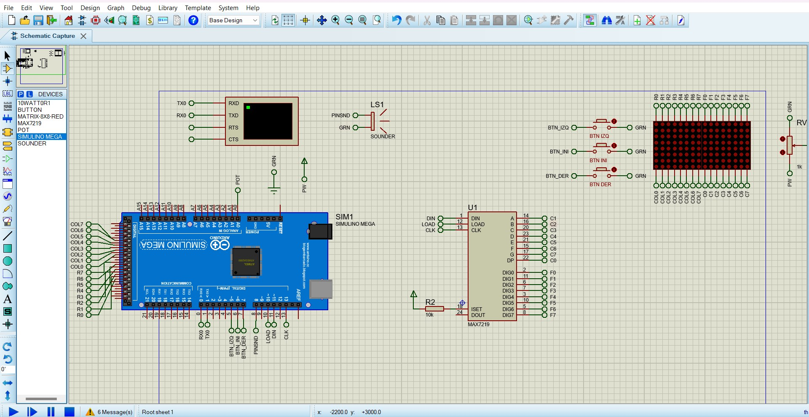
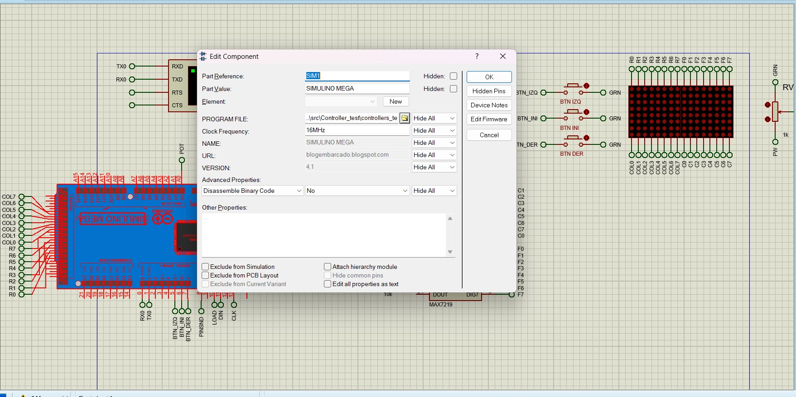
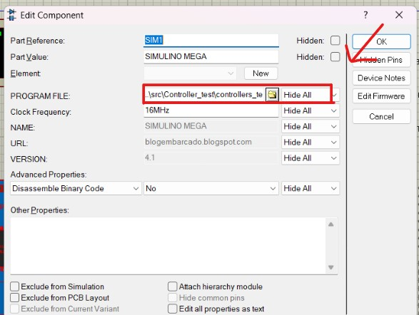
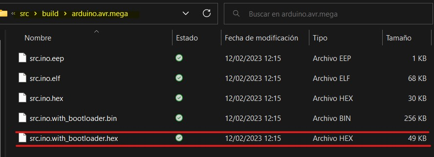
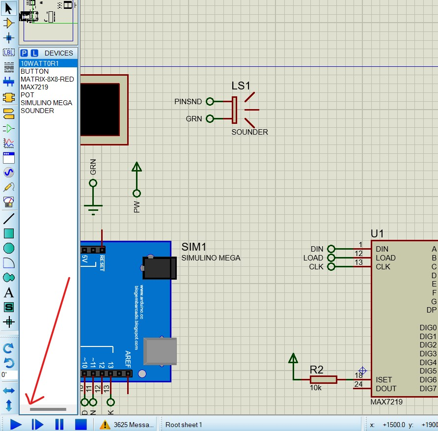
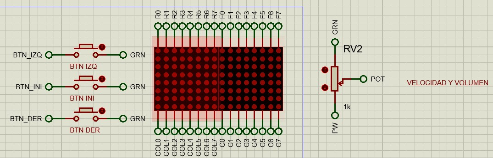
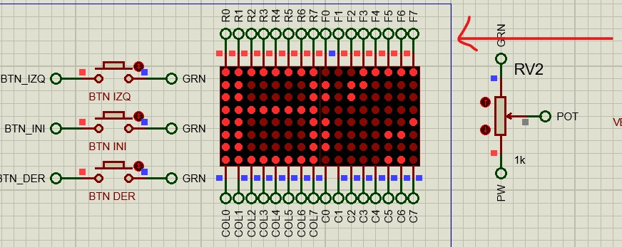
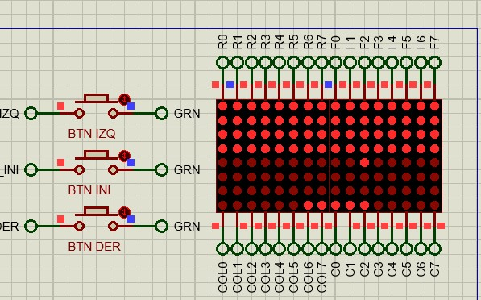
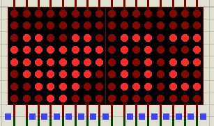

# **Práctica 1**
### Universidad de San Carlos de Guatemala
### Facultad de Ingeniería
### Escuela de Ciencias y Sistemas
### Arquitectura de Computadores y Ensambladores 1
### Sección B
  

## **Manual de Usuario**
  

| Nombre | Carnet | 
| --- | --- |
| Daniel Estuardo Cuque Ruíz | 202112145 |
| Damián Ignacio Peña Afre | 202110568 |
| Alvaro Norberto García Meza | 202109567 |
| José Manuel Ibarra Pirir | 202001800 |
----
# **Introducción**
## Descripción general
La práctica consiste en la creación de un prototipo que contiene un display que está conformado por 2 matrices LED de 8x8. Es capaz de presentar un mensaje de forma dinámica que puede ser manejado por medio de dos botones. Un tercer botón permite al usuario ingresar a una partida de una variación del juego "breakout" permitiendo interactual al usuario con el juego. 
## Objetivos y Alcance
El objetivo del prototipo es el manejo de matrices de dos maneras: por medio de controladores y sin controladores. Permitiendo al usuario experimentar con los mensajes y jugar una variación del juego "breakout". 
## Requisitos Previos 
El entorno utilizado para el desarrollo de este prototipo fue por medio de simualación haciendo uso de la libreria *Simulino* en Proteus y la libreria *LedController* en Arduino.
# **Hardware**
## Componentes y herramientas necesarias
- Una placa Arduino MEGA
- Un controlador MAX7219
- 2 Matrices LED de 8x8
- 3 Botones
- Un potenciómetro
- Resistencias
- Sounder
# **Software**
El prototipo de manera simulada necesita del software de Proteus v8.1, además en este software se necesita instalada la librería *Simulino* que permite simular las placas de Arduino. 
 Por otro lado se necesita el IDE de Arduino v2.0.3 para poder compilar los cambios de ser necesarios. Dentro de este software se necesita la libreria *LedController* que permite el manejo de las matrices LED. 
 Se recomienda el uso de estas versiones para no tener problemas de compatibilidad a la hora de la ejecución del prototipo.
# **Configuración**
## Intrucciones de configuración generales
Es necesario tener el hardware y software previamente instalado y configurado para la ejecución de la simulación.

- Se debe ejecutar el archivo de Proteus, una vez ejecutado aparecerán los componentes como se muestra en la siguiente imagen.  

- Una vez dentro es necesario corroborar que el archivo *.hex* generado en la compilación del archivo con el *IDE Arduino* esté instalado en la placa, para ello debemos dar doble click sobre la placa Arduino y verificar la dirección en el apartado de *PROGRAM FILE*.  

- De no encontrarse algún archivo seleccionado, es necesario colocar el archivo *.hex*, para ello debemos darle click al ícono de folder en el apartado de *PROGRAM FILE*, esto nos abrirá un selector de archivos, donde debemos buscar la carpeta de nombre *build* el ella se encontrarán 3 archivos, debemos seleccionar el de nombre *src.ino.with_bootloader.hex*  

# **Uso**
- Para experimentar con las funciones del prototipo debemos iniciar la simulación dentro de *Proteus*, para ello debemos iniciarla en la parte inferior izquierda.  

- Una vez iniciada la simulación nos centramos en la parte donde se encuentra el display conformado por 2 matrices LED. En el lado izquierdo encontraremos 3 botones con sus respectivas etiquetas: BTN_IZQ (movimiento a la izquierda), BTN_INIT (incia el juego) y BTN_DER (movimiento a la derecha). Del lado derecho encontraremos un potenciometro que permitirá la modificación de algunas características que describiremos a continuación.  

- Al iniciar la simualción aparecerá el mensaje de inicio, en esta fase, podemos hacer uso de los botones BTN_IZQ y BTN_DER para modificar el movimiento del mensaje en pantalla, que por defecto se mueve a la izquierda al iniciar, de igual manera podemos modificar la velocidad con la que este se mueve haciendo cambios en el potenciómetro de la derecha.  

- Presionando el botón BTN_INI durante 3 segundo, podemos acceder al juego, aparecerán los objetivos, una barra en el parte inferior y una pelota que se moverá.  

- Una vez dentro del juego se puede acceder a un menú de configuración, con el BTN_IZQ se ven las vidas restantes, con el BTN_DER se puede ver la barra de volumen.  
